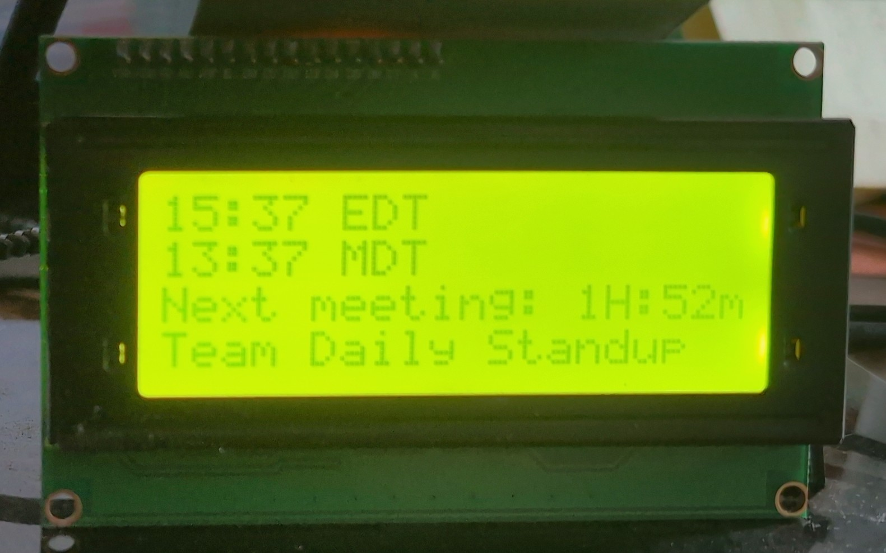

## LCD-Calendar
A simple RPi project that displays a countdown to your next meeting (populated via ICS) and up to two clocks. I use this to keep a constant monitor of my meetings and time on my desk in a low power setup and slim form factor.


### Materials & Implementation
Implemented using a Raspberry Pi 3B and a 4x20 LCD display (2004A-V1.1). The `4x20-lcd-cal.py` program uses an ICS calendar URL to find the next upcoming meeting and display a countdown to it.  
[LCD Display](https://www.amazon.com/dp/B01DKETWO2)

### Systemd
Also included is a systemd service file you can use to make the LCD controller program persistent and live on startup. Please note you will need to modify the path to the executable. Make sure to ovewrwrite the placeholder value for `LCD_CAL_ICS` to your Calendar's ICS URL. You can also set the `LCD_CAL_CLOCK1_TZ` and `LCD_CAL_CLOCK2_TZ` variables to change the clock time zone and/or add a second clock.

## Running
Clone the project to your pi, wire up your `2004A` LCD display to GPIO 2 and 3 to SDA and SDL on the display respectively (Also VCC and GND).

### Create a venv for the project
```sh
python -m venv venv
```

### Install dependencies with pip
```sh
./venv/bin/pip install RPLCD smbus2 tzdata icalendar recurring-ical-events requests tzlocal
```

### Set LCD_CAL_ICS Env Var
```sh
export LCD_CAL_ICS="https://somehost.com/somepathtocalendar.ics"
```

### Optional: Set Clock Time Zones
Not necessary, but you can override the local time zone, or add a second one using these env vars
```sh
export LCD_CAL_CLOCK1_TZ="US/Central"
export LCD_CAL_CLOCK2_TZ="US/Pacific"
```

### Execute run.sh
```sh
./run.sh
```
The LCD display should begin displaying the clock, a countdown to the next calendar event, and if available, the event's title.
